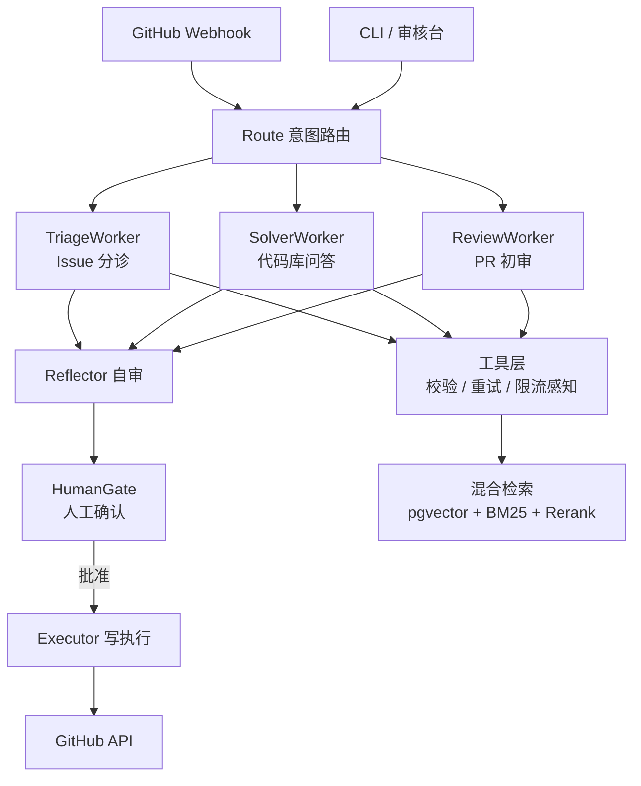

# Maintainer Copilot

面向开源项目维护者的 AI 协作者：**Issue 自动分诊**、**代码库问答**、**PR 初审**，所有对外输出（评论/标签）经人工确认后发布。

> 一句话：把你的 issue 从「积压清单」变成「已分诊的待审草稿」。

## 为什么需要它

中小开源项目（1-3 人维护）的 issue 大量是重复问题、环境配置问题和无效 issue；维护者重复回答文档里写过的内容；新人 PR 缺乏初审。Maintainer Copilot 在维护者与 issue 队列之间加了一层可审计的 AI 助理：

- **安全第一**：写工具（评论/标签）不进 LLM 的工具列表，只由确定性 Executor 在人工批准后执行；
- **代码库感知**：检索基于代码（tree-sitter AST 切分）+ 文档 + 历史 issue 三源异构索引，不是普通文档问答；
- **效果可度量**：内置评测体系（分诊 F1 / 引用精确率 / LLM-as-judge），用真实历史 issue 作回归集。

## 架构



## Quick Start

```bash
# 1. 环境准备（Python >= 3.13; 数据库用 docker compose 一键起 pgvector）
pip install uv
docker compose up -d

# 2. 安装依赖
uv sync                  # 核心依赖
uv sync --extra rag      # RAG 重依赖（embedding / rerank / tree-sitter）

# 3. 配置
cp .env.example .env     # 填入 MC_DEEPSEEK_API_KEY

# 4. 跑起来
uv run mc chat           # CLI 问答（POC）
uv run mc serve          # Web 审核台 http://127.0.0.1:8000
uv run mc mcp            # MCP stdio 模式
uv run pytest            # 测试
```

## 演示

```bash
uv run mc ask --repo freeisle/12306 "候补购票是怎么实现的？"   # 代码库问答(带引用)
uv run mc demo-triage freeisle/ragent 108                        # Issue 分诊
uv run mc demo-hitl freeisle/ragent 67                           # HITL 全链路(自审->人工批准->执行)
uv run mc mcp                                                    # MCP stdio 模式
uv run python -m eval.run_eval --suite triage --repo eval/dubbo  # 分诊 F1 评测
```

完整演示流程见 [docs/demo-walkthrough.md](docs/demo-walkthrough.md)。

## 评测基线

| 套件 | 指标 | 基线 | 说明 |
|---|---|---|---|
| 分诊 | macro-F1 | **0.49**（bug 0.79 / feature 0.50 / question 0.68 / invalid 0.00） | dubbo+rocketmq 真实标签 77 条 4 类回归集；invalid 类为 duplicate/wontfix 标注口径所致，详见报告分析 |
| 问答 | LLM-as-judge 三维 rubric | correctness 3.6 / citation_support 3.6 / usefulness 2.7（5 分制） | 10 问 + 引用硬指标; 收紧引用约束后较初版 2.7/2.2/3.0 显著提升 |

报告生成于 `docs/eval-report/`，可通过 `python -m eval.run_eval` 复现。

## 技术栈

| 层 | 组件 |
|---|---|
| Agent 编排 | LangGraph（状态机 / HITL interrupt / checkpoint） |
| RAG | pgvector + BM25 + RRF 融合 + BGE-reranker；tree-sitter AST 切分；BGE-M3 embedding |
| 工具层 | 自研 GitHub 客户端（限流感知 / 重试 / 缓存）+ FastMCP 暴露 |
| 服务 | FastAPI（webhook + HITL 审核台） |
| 评测 | 分诊 F1 回归集 + LLM-as-judge（三维 rubric）+ 引用精确率硬指标 |
| LLM | DeepSeek（主）/ Ollama（兜底），OpenAI 兼容协议 |

## 里程碑

| Milestone | 内容 | 状态 |
|---|---|---|
| M1 | 代码库问答 MVP（三源索引 + 混合检索 + 带引用回答） | ✅ |
| M2 | 分诊 + HITL 闭环（webhook → 草稿 → 审核台 → 发布）+ 评测体系 | ✅ |
| 后续 | PR 初审、Skill 自迭代、A2A 工具服务化、后训练 | 🔲 |

## License

[Apache-2.0](./LICENSE)
