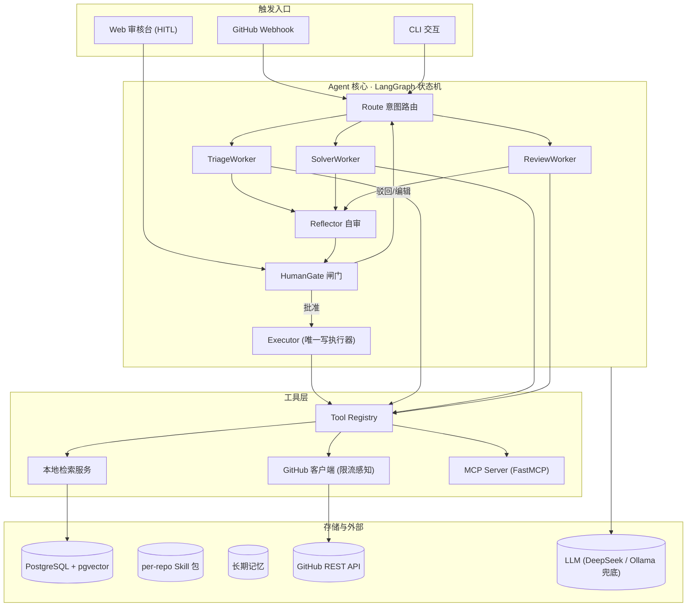
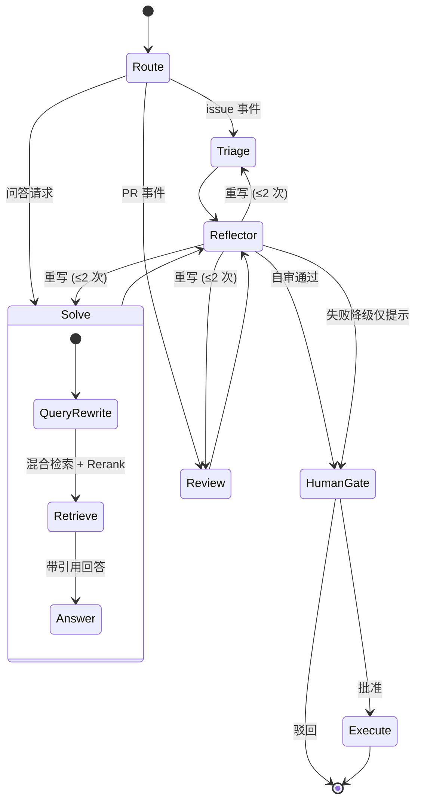

# Architecture（公开版）

> 详细设计决策见 `docs/architecture.md` 各节；个人开发记录存放于本地 devlog（不入库）。

## 1. 总体架构

## 2. 状态机

## 3. 关键设计决策与理由

| 决策 | 选择 | 理由 |
|---|---|---|
| 单 Agent vs Multi-Agent | Supervisor + 3 Worker 子图 | 上下文隔离、职责单一可独立评测、状态机显式可控；单 Agent + 多工具在工具数增长后选择准确率下降且评测困难 |
| A2A vs 子图通信 | 子图 + 类型化状态 | 单机部署无跨服务边界；A2A 留给工具服务化阶段（roadmap） |
| 框架 | LangGraph | checkpoint / HITL interrupt / 子图三大原语成熟 |
| 向量库 | pgvector | 规模不需要分布式 Milvus；SQL 管理索引、单 docker 服务 |
| 混合检索 | pgvector + 进程内 BM25 + 自实现 RRF + BGE-reranker | RRF 融合可解释可控，避免 Qdrant/ES 黑盒与额外服务 |
| GitHub 接入 | 自研 httpx 客户端（8 个端点） | 限流/重试/缓存细节可控；不引第三方 SDK |
| MCP | FastMCP 暴露同一工具层（双接口） | 内部直调 + 外部协议互不干扰 |
| 写安全 | 写工具不进 LLM 工具列表，仅 Executor 执行 | 结构性杜绝 LLM 直接触碰写权限 |

## 4. 核心难点与解法

1. **代码库检索答非所问**：三源异构索引（代码 AST 切分 / 文档标题切分 / issue 结构化切分）+ 混合检索 + 领域化查询改写（报错串精确检索优先）+ rerank + 引用精确率硬指标。
2. **幻觉对外发布**：引用强制 → Reflector 三查（有出处 / 答所问 / 符合规范）→ 重写 ≤2 次 → 失败降级仅提示 → HITL 闸门 → 灰度策略。
3. **GitHub 限流与外部依赖不可靠**：检索本地化 + 限流感知客户端（429 降级不重试、5xx/网络错误指数退避）+ webhook 幂等去重 + LLM 主备双通道。

## 5. 评测体系

- **分诊集**：真实历史 issue 的 label 作弱标注，macro-F1 每类；
- **问答集**：被维护者关闭的历史 issue，LLM-as-judge 三维 rubric（正确性/引用支撑/可用性）+ 引用精确率程序硬指标 + 人工抽检 20%；
- **工具选择集**：查询 → 期望工具，验证 tool description 质量；
- **判官偏差缓解**：双判官、位置交换、temperature=0。

## 6. 演进路线

见 [roadmap.md](roadmap.md)。
